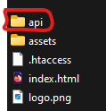
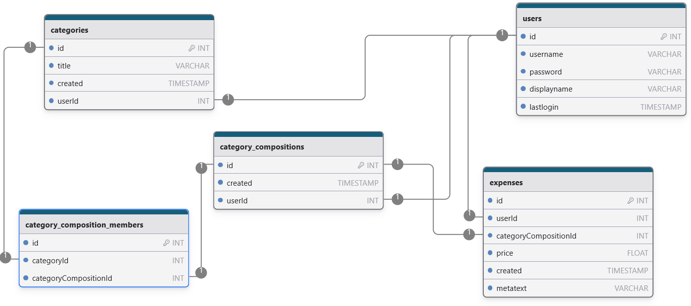

# family-expenses-list-backend
This project is the backend part to the family-expenses-list.

Read more: [frontend-project](https://github.com/Oigty81/family-expenses-list-frontend)

# 
## Project setup

### Prerequisite

- [PHP 8](https://www.php.net/downloads.php)
- [Composer version 2.5.5](https://getcomposer.org/download/)

### Install the repository
```
git clone https://github.com/Oigty81/family-expenses-list-backend.git
cd family-expenses-list-backend
composer install  
```

### Project Configuration
#### Database Setup (MySQL/mariaDB)
Create a new MySQL/MariaDB-Database
Go to folder `./config/autoload` and copy/rename `db.local.php.dist` to `db.local.php`.
Open file `db.local.php` DB-Connection-Parameter for `mainDb` (dsn, username, password)
When you would like runs all unit tests, you also should use another Database and set DB-Connection-Parameter for `mainDbUnitTest`

!!! Do never store `db.local.php` or `db.global.php` in a public repository

#### Generate an SSL key pair for json web token signature
Go to folder `./SSL` open the bash and generate key pairs for develompent and production
```
openssl genrsa -out jwt_secret_private__dev.pem 2048
openssl rsa -in jwt_secret_private__dev.pem -outform PEM -pubout -out jwt_secret_public__dev.pem

openssl genrsa -out jwt_secret_private.pem 2048
openssl rsa -in jwt_secret_private.pem -outform PEM -pubout -out jwt_secret_public.pem
```
!!! Do never store SSH Key Pair in a public repository

Go to file `./src/App/config/auth.local.php` and make sure the filenames for the key-files is correct

### Import the Postman Collection
`./_postman/FamilyExpensesList.postman_collection.json`

### Backend-Service
Backend-Service can enable or disable  in `./src/App/config/app.local.php`
```
"backendServiceEnabled" => true,
```

!!! Always disable backend-service in production environment

### Create Database-Tables, Users and initial content
Make sure that Backend-Service is enabled.

Execute Requests in this order for example with Postman or curl: (create tables / create user / create initial content)

One user is necessary to create initial content (replace username, password and displayname in the url-query)
```
GET     {{baseUrl}}/v1/backendservice/createTableStruct
POST    {{baseUrl}}/v1/backendservice/createUser?username=max1&password=1234&displayname=Max%20Muster
GET     {{baseUrl}}/v1/backendservice/createInitialContent?username=max1

```

### Start development server
```
composer run serve
```

### Run unit tests
```
composer run tests
composer run test-without-db
./selected_unittests.bat
```

### Deployment (Apache example)
Use
```
composer run deploy:x
```
Make sure the deployment path in the `composer.json` is correct.

Build frontend-bundle first.

Its destination should be a sub-folder named `/api` in the frontend-bundle.



The `.htaccess` file from the frontend-project rules all routes which starts with `/api/*` to this backend

###

## Database model


# 